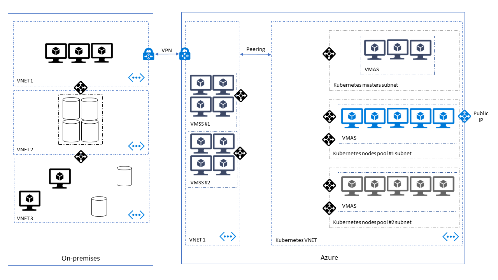

# Running Kubernetes in a hybrid environment

# Intro

Setting up Kubernetes in a hybrid environment imposes some requirement on the setup, and implies some considerations around how you will configure your cluster, and plan your deployments. In this guide, we will look at a typical hybrid cloud setup to deploy Kubernetes.

Note : We do not cover a Kubernetes cluster _spanning_ a hybrid cloud network, but rather how to run a cluster in the cloud and interact with an existing local network seamlessly.



# Pre-requisites

# Infrastructure

## Express Route / VPN

## Peering

## Topology

The network topology must be well defined beforehand to enable peering between the different VNET. This means that the subnet ip range musty be defined before deploying kubernetes. It cannot be changed afterwards.

## Dns

# Kubernetes

## Network

By default, acs-engine network policy is using the **azure cni** plugin. This has some advantages and some consequences that must be considered when defining the network where we deploy the cluster. CNI provides an integration with azure subnet ip addressing so that every pod created ny kubernetes is assigned an ip address from the corresponding subnet.

Consequences:

- --Subnets where you deploy Kubernetes must be sized according to your scaling plan
- --You must account for Kubernetes components
- --Network Security must be applied at the subnet level, using Azure NSG
- --No masquerading happens on outgoing network calls (packets origin are the pod ip, not the node ip)

## Kubernetes Services

[Kubernetes Services](https://kubernetes.io/docs/concepts/services-networking/service/) allow to access workloads running inside Kubernetes pods.
Services can be published to be accessible outside of the Kubernetes cluster, either with a public Azure Load Balancer or with a private Azure Load Balancer (no public IP address).

### Public load-balanced service

```yaml
apiVersion: v1
kind: Service
metadata:
  name: sqlservice
  labels:
    app: sqlservice
spec:
  type: LoadBalancer # Exposed over the internet through Azure Load Balancer
  ports:
  - port: 1433
    targetPort: 1433
  selector:
    app: sqlinux
```

### Private load-balanced service

```yaml
apiVersion: v1
kind: Service
metadata:
  name: nginx-internal-load-balancer
  annotations:
    service.beta.kubernetes.io/azure-load-balancer-internal: "true"
spec:
  selector:
    app: nginx
  ports:
    - protocol: TCP
      port: 80
      targetPort: 80
  type: LoadBalancer
```

### External services

When working in a cloud-hybrid environment, it is common to have to deal with external backend services that are running outside the Kubernetes cluster. They can be either running elsewhere in the cloud or on premise, for example.

In those cases you can use services without selector:

```yaml
kind: Service
apiVersion: v1
metadata:
  name: external-random-api
spec:
  ports:
  - protocol: TCP
    port: 80
    targetPort: 8080
```

No endpoint will be created for this service. You can create one manually:

```yaml
kind: Endpoints
apiVersion: v1
metadata:
  name: external-random-api
subsets:
  - addresses:
      - ip: 11.1.0.4
    ports:
      - port: 8080
```

Or you can use an external name in the specficiation of the service:

```yaml
kind: Service
apiVersion: v1
metadata:
  name: external-service
  namespace: default
spec:
  type: ExternalName
  externalName: external-service.my-company.com
```

Note: when using service without selector, you can't have any Kubernetes readiness/health probe so you have to deal with this point by yourself. For backend services running in Azure, you can use Azure Load Balancers for health probes.

## Devops

# Conclusion

