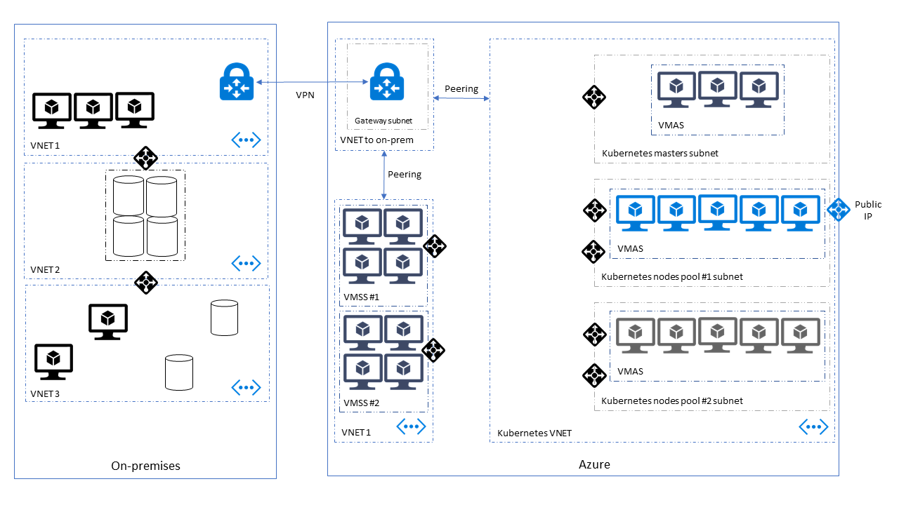

# Running Kubernetes in a hybrid environment

# Intro

Setting up Kubernetes in a hybrid environment imposes some requirement on the setup, and implies some considerations around how you will configure your cluster, and plan your deployments. In this guide, we will look at a typical hybrid cloud setup to deploy Kubernetes.

Note : We do not cover a Kubernetes cluster _spanning_ a hybrid cloud network, but rather how to run a cluster in the cloud and interact with an existing local network seamlessly.

# Pre-requisites

# Infrastructure

## Express Route / VPN

## Peering

## Topology

The network topology must be well defined beforehand to enable peering between the different VNET. This means that the subnet ip range musty be defined before deploying kubernetes. It cannot be changed afterwards.

## Dns

# Kubernetes

For your kubernetes cluster to communicate with your on-premise network, you will have to deploy it to the existing vnet setup with VPN/ExpressRoute. deploying to an existing VNET is documented under [Custom VNET](https://github.com/Azure/acs-engine/blob/master/docs/custom-vnet.md).

## Network

### Azure CNI

By default, acs-engine is using the [**azure cni** network policy](https://github.com/Azure/acs-engine/blob/master/examples/networkpolicy/README.md#azure-container-networking-default) plugin. This has some advantages and some consequences that must be considered when defining the network where we deploy the cluster. CNI provides an integration with azure subnet ip addressing so that every pod created ny kubernetes is assigned an ip address from the corresponding subnet.

Consequences:

- Subnets where you deploy Kubernetes must be sized according to your scaling plan
- You must account for [Kubernetes control plane](https://kubernetes.io/docs/concepts/overview/components/)
- Network Security must be applied at the subnet level, using Azure NSG
- You can avoid masquerading on outgoing network calls (packets origin are the pod ip, not the node ip)

### Kubenet

The built-in kubernetes network plugin is [Kubenet](https://kubernetes.io/docs/concepts/cluster-administration/network-plugins/#kubenet)

## Services

## Devops

# Conclusion
